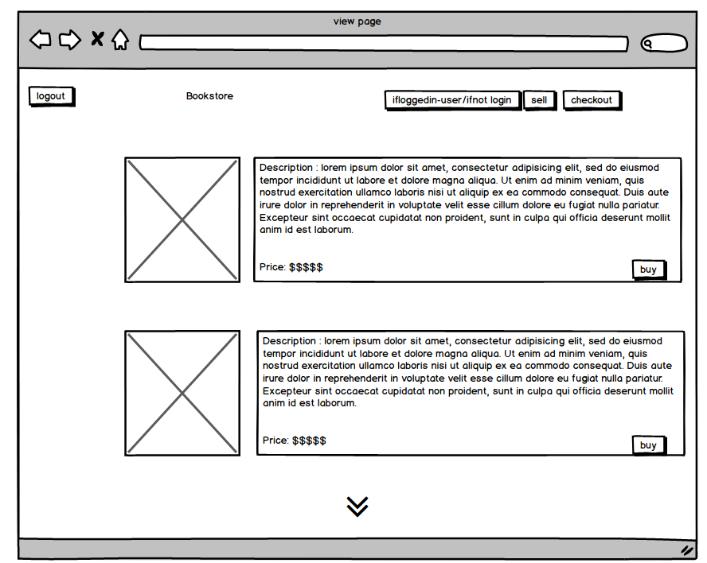

# README
<h2>The Problem </h2>
The problem i am addressing is that on facebook market place it is difficult to sell products such as books that you may want to have more knowledge then just the title  of the book, another problem with shopping in store along with corona virus, is people coming and talking to you while your just trying to find a good book to read

<h2>Why is it a problem that problems</h2>
This is a problem as if your wanting to make a few extra dollars or find a good quality book, rather then waiting weeks on facebook market place trying to find a book at a good price using the readme bookstore 

<h2>https://github.com/TripleHop/readme-books</h2>
<h2>https://readme-bookstore.herokuapp.com/</h2>
<h2>My App</h2>
The purpose of my app is to provide a quick and easy way to buy and sell books in a easy to view format
<h2>Features</h2>
some of the features included in my app 
<li>a login and log out feature and account storage</li>
<li> Admin/seller has the ability to edit and delete the book they made and has a level of authorization to keep this in check </li>
<li>Buy has the ability to view all listings and rearrange into high to lowest on price and rearrange alphbetically</li>
<li>Photos can be added by the seller and also viewed by the buyer and seller </li>
<li>a seller can/should provide at least, The author, book title, blurb, photo(optional), ware of the book and a price allowing for alot of good information for the buyer to look into to review if they want the book</li>
<h2>User story</h2>
For my app i wanted people to have certain features that will allow for easy and fast use.
<li>A sort for highest to lowest as some book enthuiests arent too fussed on the type of book and may want to find the cheapest book availble</li>
<li>A login in feature for quick and easy use of the app</li>
<li>Users may want to buy multiple books so rather then having a buy this, having a Cart to add multiple books would be good</li>
<li>People searching for a certain book may want to be searching through alphbetical</li>
<li>Allowing for more information on the book being sold such as Blurb and condition may help the decision of the buyer</li>
<h2>wireframes</h2>

<h2>Sitemap</h2>

<h2>Erd</h2>

<h2>Third-party</h2>
<li>AWS S3 Bucket (used for image storage)</li>
<li>Heroku( used for deployment of the app along side with github)</li>
<li>Github(used for the remote source control and backup)</li>
<h2>Models and relations </h2>
<ul>Book model
<li> Belongs to user </li>
<li> has_many lineitems</li>
The book model being the main used item in the project has the associations with belonging to the user as the user will create a book and then using the line items connects the cart thus why the has_many is being used on line_items allowing for many books to be inside of the line_item
</ul>

<ul> Cart
<li>has_many line_items</li>
<li></li>
The Cart model only has the Line_items as the user logic is inside of the user model, only line_items is used in the process of creating a cart</ul>
<ul> User
<li>Has_many books</li>
User only needs to Has_many books to create a listing and and be able to connect with the books model
</ul>

<ul> Line item
<li>Belongs to cart</li>
<li> Belongsto book</li>
Line item requires cart and book to allow for these to be added to the join table to create the Cart that will be used in the checkout process
</ul>
<h2>High level components </h2>
User authentication: User authetications was provided by using the devise gem, while this can be done without the use of devise it would take alot more lines of code and not the best result using the Devise gem also insures a higher quality of Authentication for the users.

Database: Using postgresql allows for an easy way to store our data and control the migrations used in rails rather then handling the data by hand

User authorization: Cancancan was used for authorization similar to authetication while it is possible to do by hand its much easier to impliment a highly used gem so control the flow of what users have access to.

Ransack, Ransack was used to allow for quick and easy use of a sort function which arent difficult to create ransack is extremely quick easy and simple to implement into code
images: AWS S3 buckets are used to store images in a reliable place and to avoid unneccassry data on the own site, and provides great use of the active storage

<h2>Trello </h2>
At the start of the project id added basic things i wanted into my app and was going to add futher idea to the trello board but after getting sick began to rush to missed keep things i wanted to add, If i had added more depth into the trello it may have been able to keep me more on-track but pressure got the better of me rather then adding evreything just wanted MVP

<!-- This README would normally document whatever steps are necessary to get the
application up and running.

Things you may want to cover:

* Ruby version

* System dependencies

* Configuration

* Database creation

* Database initialization

* How to run the test suite

* Services (job queues, cache servers, search engines, etc.)

* Deployment instructions

* ... -->
